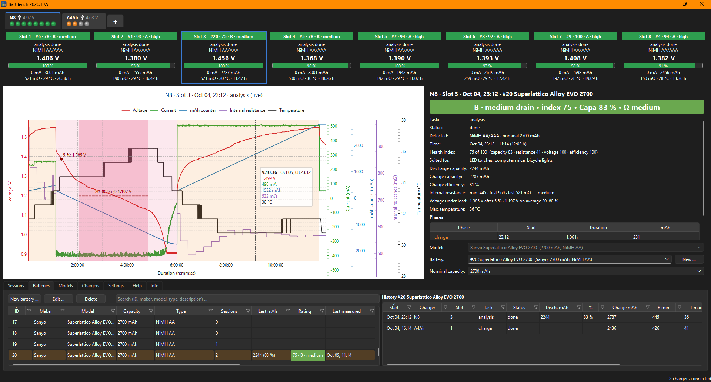

# BattBench

**Battery test bench for your PC: track every rechargeable cell over its whole life and see how it ages.**

[](docs/screenshot.png)

*Two chargers with twelve slots live, each slot with its battery and rating; the chart of a capacity test with the
plateau of the discharge marked, its health index and the history of the battery.*

BattBench reads ISDT and SkyRC chargers over **USB** and **Bluetooth**, records their readings, detects charge and
discharge runs, rates each battery against its nominal capacity and keeps a **history per battery**. Several chargers
can be connected at the same time. BattBench only ever *reads* from the chargers; it never changes a setting and never
starts or stops anything.

The user interface is available in **English** and **German**. The user guide below is also built into the app
(tab *Help*).

## Why this app?
I have loved my ISDT N8 for years, but one thing always bugged me: the result of the analysis. I want to see how much
capacity my batteries have left, yet as soon as discharging is done, that number is gone from the display.

Thanks to the [isdttool](https://github.com/maxried/isdttool) library by [maxried](https://github.com/maxried), I was
able to write a "works for me" battery analysis tool together with Claude Opus 5.5 in no time. It listens in on the
charger over USB and logs everything for me – and on top of that keeps a database of all my batteries.

## Features
- **Live view** of every slot of every connected charger: mode, voltage, current, mAh, internal resistance,
  temperature, progress.
- **One chart per run** with voltage, current, mAh, internal resistance and temperature, each on its own axis.
- **Automatic session detection**, also across restarts of the app.
- **Rating**: a health index from capacity, internal resistance, voltage under load and charge efficiency, with a
  category (A high drain … D recycle) and what the cell is still good for.
- **Battery tracking**: a number per cell and its whole history, across chargers and slots.
- **Battery models** with nominal capacity; a list of common cells is included.
- Spreadsheet-like filters on all tables, light and dark Windows theme.

## Installation
### Windows
Download `BattBench-<version>-setup.exe` from the [releases](https://github.com/fashberg/battbench/releases) and run
it. It installs for the current user (no
administrator rights needed), adds BattBench to the Start menu and, if you like, to the desktop. Uninstalling asks
whether to keep your measurements.

### From source (Windows, Linux, macOS)
Requires Python 3.10 or newer.
```
git clone https://github.com/fashberg/battbench.git
cd battbench
run.bat          (Windows)
./run.sh         (Linux / macOS)
```
The first start creates a virtual environment in `.venv` and installs the requirements. On Linux, USB access to the
chargers needs a udev rule for the ISDT USB id, e.g. `/etc/udev/rules.d/70-isdt.rules`:
```
SUBSYSTEM=="hidraw", ATTRS{idVendor}=="28e9", ATTRS{idProduct}=="028a", TAG+="uaccess"
```

### Command line options
| Option | Effect |
|---|---|
| `--offline` | only view the database, no chargers |
| `--db FILE` | use another database file (or set the environment variable `BATTBENCH_DB`) |
| `--lang auto\|en\|de` | user interface language (also in the app, tab *Settings*) |
| `--a4 usb\|bt\|both` | how the A4 Air is read (also in the app, tab “+”) |
| `--no-bt` | no Bluetooth at all |

<!-- help: everything up to the end marker is also the built-in help (tab Help); keep help_de.md in step -->
## User guide

### What BattBench does
BattBench turns your charger into a battery test bench. It reads every slot of every connected charger once a second
and stores a reading every 10 seconds (every change of task or current direction at once). From these readings it recognises **sessions** – one task of one battery in one slot, from
inserting it until it is taken out or another task starts – with their charge and discharge **phases**. A session
that measured a discharge gets a **rating**. If you give your batteries **numbers**, every session can be assigned
to its battery, and you see how each cell ages over the months.

BattBench never changes anything on the charger: start, stop and settings are done on the charger as usual.

### Before you start
- Close the official **ISD Go** updater: it opens the chargers over USB exclusively.
- Quit the **ISD Link** phone app (or switch off Bluetooth on the phone). An ISDT Air charger accepts only one
  Bluetooth connection and is invisible to others while the phone is connected.
- Chargers powered over USB (e.g. the N8): see *Power supply* below.

### Power supply
- A charger that gets its power from the USB cable (e.g. the N8) most likely gets **too little power from the PC**:
  a PC USB port usually supplies only 5 V at 0.5–1.5 A, without USB Power Delivery. The N8 then charges with only
  about 100 mA per slot once about four slots charge (discharging is not affected), so an analysis of 8 cells can
  take two days.
- Better: connect the charger through a **USB-C hub with Power Delivery** (PD). A USB-PD power supply feeds the hub,
  the hub's upstream cable goes to the PC – the charger gets its full power and BattBench still reads it.
- Not every hub passes PD on to every port (many give the full power only to the computer). If the charge current
  stays low, try another port or another hub.
- Chargers with their own mains or DC power supply are not affected.

### Numbering batteries and models
- Write a **number** on each cell (e.g. with a paint marker) and create it in the tab *Batteries* with *New battery …*
  using the same number. *Count* creates several identical batteries with consecutive numbers at once.
- Choose the **model** (e.g. “Panasonic eneloop pro AA”): it supplies maker, type and **nominal capacity**. Typing in
  the list filters it, e.g. “ene pro aa”. BattBench comes with a list of common cells; add your own in the tab
  *Models* or with *New …* in the battery dialog. Changing a model updates all its batteries and rates their
  sessions again.
- A battery without a model gets maker, type and capacity typed in by hand.

### Measuring
1. Insert the battery and start a task on the charger. A capacity is measured by **analysis** (charge – discharge –
   charge), **discharge** or **cycle**; a plain charge gives no capacity.
2. Click the slot tile: the chart and the result panel show the running session.
3. In the result panel choose the **battery** (or first the model to narrow the list). Every change is saved at once.
   Without a battery, pick a model or type the **nominal capacity** (suggestions 500–3000 mAh, any value can be
   typed).
4. When the discharge is over, the session is rated. While it is still running the panel shows e.g.
   “analysis running”.

The N8 does not tell AA from AAA, so its sessions are only rated once a battery, model or nominal capacity is set.

### The values
- **Discharge capacity** – what the battery delivered during the (last) discharge. Compared with the nominal
  capacity it gives the rating.
- **Charge capacity** – what was put in after the discharge. It is higher than the discharge capacity because
  charging has losses; discharge ÷ charge is the charge efficiency (typically 70–90 % for NiMH).
- **Internal resistance** – as the charger measures it; **lower is better**. It rises with age and wear, and a high
  value lets the voltage drop under load. The chargers include the contact resistance, so the values are higher than
  those of a dedicated meter. *min.* is the lowest value of the session, first and last the values at its start and
  end.
- **Temperature** – the highest temperature of the session. NiMH cells get warm towards the end of charging; above
  about 45 °C the cell is stressed.
- **Status** – *running* (with *charging* / *discharging*), *done*, *removed* (taken out before the end) or *aborted*
  (stopped, replaced by another task, or the data broke off).

### Rating
A session that measured a discharge (analysis, discharge, cycle) gets a **health index** from 0 to 100 and from it a
**category**. The index is made of four scores of 0–100 each:

| Score | Weight | From |
|---|---|---|
| Capacity | 40 % | discharge capacity in % of the nominal capacity |
| Internal resistance | 30 % | lowest internal resistance of the session |
| Voltage under load | 20 % | voltage curve of the (last) discharge |
| Charge efficiency | 10 % | discharge capacity ÷ the charge put in after it |

**Capacity** – SoH = discharge capacity ÷ nominal capacity × 100:

| SoH | Score |
|---|---|
| from 90 % | 100 |
| 70–90 % | 100 − (90 − SoH) × 2.5, i.e. 50 … 100 |
| 50–70 % | 50 − (70 − SoH) × 2, i.e. 10 … 50 |
| below 50 % | 0 |

**Internal resistance** – as the charger measures it. Contacts and leads are included, so a healthy NiMH AA shows
about 150–220 mΩ on an N8 where a 4-wire meter shows 20–30 mΩ. The usual steps for 4-wire values (30 / 60 / 120 /
250 mΩ) are therefore moved to the charger scale; in between the score falls in a straight line:

| NiMH / NiCd / NiZn | Li-ion / LiFePO4 | Score | Shown as |
|---|---|---|---|
| below 150 mΩ | below 50 mΩ | 100 | very good |
| 150–300 mΩ | 50–100 mΩ | 100 → 75 | good |
| 300–450 mΩ | 100–150 mΩ | 75 → 40 | medium |
| 450–600 mΩ | 150–200 mΩ | 40 → 0 | poor |
| from 600 mΩ | from 200 mΩ | 0 | very poor |

**Voltage under load** (NiMH) – from the readings of the last discharge. The positions are fractions of the charge
taken out (added up from the current), so a slow end of the discharge doesn't shift them:
- *V5* = voltage after 5 %: below 1.15 V costs (1.15 V − V5) × 200 points,
- *Vmid* = average voltage from 20 to 80 % (the plateau): below 1.20 V costs (1.20 V − Vmid) × 150 points,
- *early drop* = below 1.0 V before 80 %: costs 30 points.

Score = 100 minus these points (at least 0). The limits hold for a discharge current of about 0.2 C (about 500 mA for
an AA, the current of the N8). The chart shades the plateau of the last discharge darker and marks both values.

**Charge efficiency** – η = discharge capacity ÷ charge put in after the discharge; it counts once that charge is
finished:

| η | Score |
|---|---|
| 75–85 % | 100 (normal for NiMH) |
| 65–75 % | 100 − (75 − η) × 3 |
| below 65 % | 70 − (65 − η) × 4, at least 0 (losses, heat) |
| above 85 % | 50 (the charge may have ended early) |

The N8 often reports a charge only a little above the discharge (90–100 %); with a weight of 10 % this costs at most
5 points.

**Health index** = 0.4 × capacity + 0.3 × resistance + 0.2 × voltage + 0.1 × efficiency. A score that can't be worked
out is left out and the weights of the others scaled up to 100 %: no charge after the discharge (task *discharge*, or
still charging), no voltage curve, no resistance – or only an estimated one: the A4 Air over USB reports none,
BattBench estimates it from its charging pauses (≈ in the slot tile) and doesn't rate it.

| Category | Condition | Suited for |
|---|---|---|
| A · high drain | index from 85 and resistance below 300 mΩ (Li-ion: 100 mΩ) | flash units, RC models, motorised toys |
| B · medium drain | index 70–85 | LED torches, computer mice, bicycle lights |
| C · low drain | index 50–70 | remote controls, wall clocks, solar lights |
| D · recycle | index below 50, capacity below 70 % or resistance score 0 | no longer usable |

The tables show the rating as index · category, e.g. *98 · A · high*, and sort by the index (best first on the first
click); the slot tiles show it behind the battery, e.g. *Slot 4 – #5 · 78 · B · medium*.

Without a nominal capacity there is no rating (assign the battery or enter it). A cell without a capacity
measurement but with a very high resistance (from 1000 mΩ NiMH / 400 mΩ Li-ion) is marked *suspicious*. Sessions
measured with an older version are evaluated from their stored readings when the app starts.

The limits follow IEC 61951-2 (end of discharge at 1.0 V at 0.2 C, charge efficiency of NiMH), the data sheets of
Panasonic eneloop, GP and Varta (internal resistance) and the 80 % / 50 % capacity limits of chargers like the SkyRC
MC3000 and Maha MH-C9000.

### Using the app
- **Charger tabs** at the top: name, input voltage, connection (USB / Bluetooth symbol) and one LED per slot – grey
  empty, orange charging, pink discharging, blue analysis / activation / cycle, green done, red error. The “+” tab
  lists the supported chargers, the Bluetooth search and how to read the A4 Air.
- **Slot tiles**: values of the slot; the bar shows the charger's progress, its arrows run towards 100 % while
  charging and towards 0 % while discharging. Click a tile to see its session; if a battery is assigned, the
  *Batteries* tab below opens with its history.
- **Chart**: point at a curve, legend entry or axis to highlight it; click a legend entry or axis to show or hide a
  value. Click a shaded phase (or a row in the phase list) to see only that phase. Drag to draw a frame and zoom to
  it; once zoomed in, dragging in the lower two thirds scrolls through time (the upper third still draws a frame).
  Right click zooms out; the house symbol (bottom left) shows everything again. The last discharge shows its plateau
  (20–80 %) shaded darker, with the average voltage there (dashed) and the voltage after 5 % (dot).
- **Tables** (bottom): click a column title to sort; the funnel in a column title filters like a spreadsheet.
  *Sessions* lists all sessions, *Batteries* your batteries with their history on the right (clicking a battery shows
  its latest session in the chart, clicking a session in the history shows that one), *Models* the model list,
  *Chargers* the known chargers (rename them here – the name is stored only in BattBench).
- **Keys in the tables**: arrow keys move, Enter edits a battery / model (in *Sessions*: jumps to the battery
  field), Del deletes.
- **Deleting**: right click (or Del) on sessions, batteries or models (Ctrl / Shift selects several). Deleted entries are
  only hidden; *Settings* can show them again (grey) – deleting such an entry once more removes it for good.

### Supported chargers
| Charger | Connection | Slots | Tested |
|---|---|---|---|
| ISDT **N8** | USB | 8 | ✔ |
| ISDT **A4 Air** | Bluetooth (recommended) or USB | 4 | ✔ |
| ISDT N16 / N24 | USB | 16 / 24 | – |
| ISDT C4, C4 EVO, A4, UC4 | USB | 4 | – |
| ISDT A8 Air, C4 Air | Bluetooth | 8 / 6 | – |
| SkyRC MC3000, MC5000 | Bluetooth | 4 | – |

Chargers marked “–” are supported by protocol but have not been tried on real hardware yet.

### Your data
All readings, sessions, batteries and models are stored in one database file (SQLite) on your computer, normally
`%LOCALAPPDATA%\BattBench\battbench.db`. The tab *Info* shows which file is used, *Settings* its size and number of
entries. Nothing is sent anywhere.
- **Backups**: BattBench saves a compressed copy next to the database (`battbench.db-YYYYMMDD-HHMMSS.gz`) when it is
  closed and, while it runs, every 12 hours. Kept are the last 10 backups plus the newest one of each of the last 20
  days, 8 weeks and 24 months; all of this can be changed in *Settings*. To restore one, unpack it (e.g. with 7-Zip)
  and replace `battbench.db` while BattBench is closed.
- **Compressing old readings** (*Settings*, on by default): readings older than two weeks are reduced to one per
  minute automatically – per minute the median of voltage, current, resistance and temperature and the last counter values;
  sessions and ratings stay as they are, only the curves of old sessions get coarser. *Compress all readings now*
  does this for everything except the last hour and running sessions. A day of eight busy slots shrinks to about a
  thirtieth.
- **Optimise database** (*Settings*) rewrites the file without unused space.
<!-- /help -->

## Versions
Releases are numbered by year and month: `2026.10`, bug fix releases `2026.10.1`, `2026.10.2`, … Run from a git
checkout, BattBench also shows the commit it runs from (tab *Info*, `--help`).

## Development
See [CLAUDE.md](CLAUDE.md) for the code layout and conventions, [ChargerDetails.md](ChargerDetails.md) for what is
read from each charger.
- Run from source: `run.bat` / `run.sh` (arguments are passed on).
- Translations: texts in the code are English and wrapped in `tr()`. After changing texts run
  `.venv\Scripts\python battbench\translations\update.py`, translate the new entries in
  `battbench/translations/battbench_de.ts` (e.g. with `pyside6-linguist`) and run the script again.
- Built-in help: the *User guide* section above (between the help markers). `update.py` copies it to
  `battbench/help/help_en.md`; the German `help_de.md` is translated by hand (the script warns when it is older).
- Windows installer: install [NSIS 3](https://nsis.sourceforge.io), then
  `powershell -ExecutionPolicy Bypass -File packaging\build.ps1` → `build\BattBench-<version>-setup.exe`.
- Release: `.venv\Scripts\python packaging\release.py` asks for the version (suggests the next one), commits it,
  tags `v<version>`, builds the installer and offers to push. `--dry-run` only shows what it would do.

## Credits
- USB protocol library: [isdttool](https://github.com/maxried/isdttool), used as a patched fork:
  [fashberg/isdttool](https://github.com/fashberg/isdttool).
- ISDT Air Bluetooth protocol: [isdt_air_ble](https://github.com/mtheli/isdt_air_ble),
  [ISDT-Charge-Utility](https://github.com/DittelHome/ISDT-Charge-Utility).
- SkyRC Bluetooth protocol: [skyrc-mc3000](https://github.com/kolinger/skyrc-mc3000),
  [skyrc-mc-rs](https://github.com/rssdev10/skyrc-mc-rs).

BattBench is not affiliated with ISDT or SkyRC. Chargers and batteries can be dangerous – never leave them
unattended. This software comes without any warranty.

## Author and license
Folke Ashberg, [www.ashberg.de](https://www.ashberg.de) · [github.com/fashberg/battbench](https://github.com/fashberg/battbench).
GPLv3, see [LICENSE](LICENSE).
